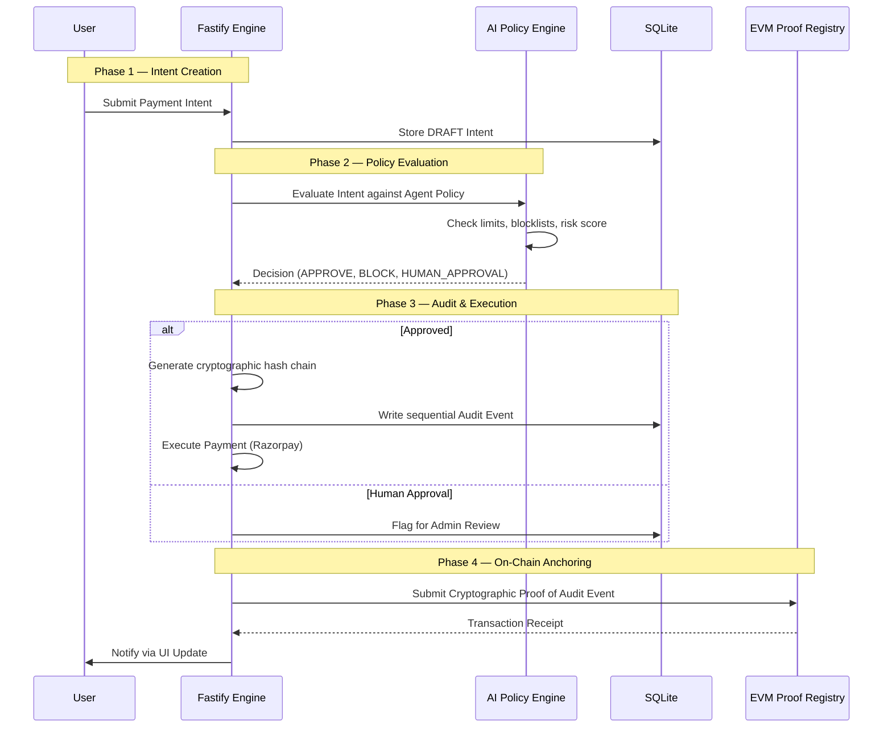
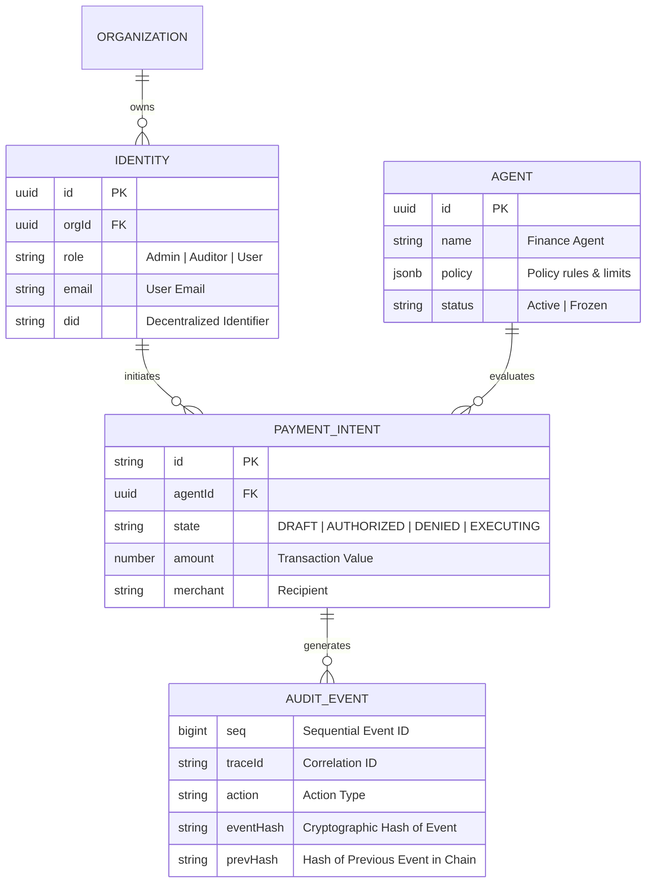

<div align="center">


# ⬡ TRUSTWEAVE

### *Verifiable identity, authorization, digital assets and governed AI actions.*

> Authenticate the identity. Authorize the action. Verify the asset. Prove everything.

[](https://trustweave.vercel.app/)
[](https://trustweave-backend.onrender.com)
[](https://github.com/Pritam9078/TrustWeave)

</div>

---

## 🚀 Live Links

- **🌐 Live Demo (Frontend):** [https://trustweave.vercel.app/](https://trustweave.vercel.app/)

- **⚡ Backend API Server:** [https://trustweave-backend.onrender.com](https://trustweave-backend.onrender.com)

- **📐 System Architecture:** [SYSTEM_ARCHITECTURE.md](./SYSTEM_ARCHITECTURE.md)
---

## ✦ What is TrustWeave?

**TrustWeave** ensures that every actor — human or AI — holds a cryptographically verifiable identity, and every consequential action is decided by a server-side authorization engine before anything happens.

The central commitment is one sentence: **AI proposes, the authorization engine decides.** A model's output is a typed proposal with no authority of its own. The only path from a proposal to a domain service is the Tool Gateway, which re-authorizes from scratch.

No intermediaries. No assumptions. Just math and policy.

---

| Feature | Description |
|---|---|
| 🛡️ **11-Gate Authorization** | Evaluates capability, resource scope, policy, limits, and approvals in a fixed order and returns an explainable trace |
| 🧠 **Secure RAG Architecture** | Role-aware Retrieval-Augmented Generation that filters out-of-scope context before it reaches the LLM |
| 🤖 **Governed AI Operations** | Deterministic rule-based proposal extraction or live LLM integration with forced tool calls |
| 🏛️ **Role-Based Identity** | Granular dashboards and scopes for **Admins**, **Managers**, **Auditors**, and **Users** |
| 🔗 **Cryptographic Audit** | Real EVM integration storing Identity, Asset, Agent, and Proof Registries |
| 💎 **Enterprise Interface** | A responsive, high-fidelity UI featuring dynamic timelines, data-rich tables, and policy evaluation breakdowns |

---

## ✦ Technology Stack

```
┌──────────────────────────────────────────────────────────────┐
│                       TRUSTWEAVE STACK                       │
|──────────────────┬───────────────────────────────────────────┤
│  Frontend        │  React 18 · Vite · React Router 6         │
│                  │  TailwindCSS · Lucide Icons · Recharts    │
├──────────────────┼───────────────────────────────────────────┤
│  Backend         │  Node.js (≥ 22.5) · Fastify · TypeScript  │
│                  │  Zod Validation · node:sqlite             │
├──────────────────┼───────────────────────────────────────────┤
│  Blockchain      │  Hardhat · Solidity (EVM)                 │
│                  │  Ethers.js / Viem Integration             │
├──────────────────┼───────────────────────────────────────────┤
│  Integrations    │  Razorpay (Payments) · Anthropic (LLM)    │
│                  │  Ed25519 DID Authentication               │
└──────────────────┴───────────────────────────────────────────┘
```

---

## ✦ System Architecture & Secure RAG

### 1. High-Level System Architecture

This diagram shows the structural relationship between the protocol layers, including our AI Policy Engine and the Blockchain Proof Layer.

```mermaid
graph TD
    subgraph FE["Sovereign Interface — Frontend"]
        A[Dashboard & UI]
        B[Agent Configuration]
        C[Governance Hub]
        D[Payment Requests]
        E[Audit Timeline]
    end

    subgraph BE["Orchestration Engine — Backend"]
        F[Fastify API Server]
        G[Policy & Authorization Engine]
        H[Payment Service (Razorpay)]
        I[Audit & Hash Engine]
        J[(SQLite DB)]
    end

    subgraph CHAIN["Consensus Layer — EVM Blockchain"]
        K[Identity Registry Contract]
        L[Agent Registry Contract]
        M[Asset Registry Contract]
        N[Proof Registry Contract]
    end

    A -- "REST Calls" --> F
    D -- "Initiate Intent" --> G
    G -- "Evaluate Policy" --> J
    F -- "External Payment Exec" --> H
    G -- "Immutable Log" --> I
    I -- "Record State" --> J
    I -- "Anchor Cryptographic Proof" --> N
    F -- "Verify On-Chain" --> L
```

### 2. Secure Retrieval-Augmented Generation (RAG)
TrustWeave implements a highly secure RAG pipeline that enforces access control **before** generation. The `ragService.ts` evaluates the authenticated actor's tenant boundaries and identity scope. If a user asks the LLM a question outside their clearance, the RAG engine filters the evidence, and the LLM explicitly denies the answer with an explainable authorization trace. It also features built-in prompt-injection detection to preserve the integrity of the intent engine.

### 3. Agent Evaluation & Audit Flow
This sequence diagram illustrates the lifecycle of a payment intent operation — from rule triggering to blockchain-anchored finality.



### 4. Database Schema & Audit Anchoring
The models are structured to ensure absolute accountability through cryptographic hashing on every state transition.



### 5. Audit Chain Integrity Workflow
To maintain absolute transparency, the protocol records all state changes as an append-only linked list of cryptographic hashes in the database.

```mermaid
graph LR
    A[Action Triggered] --> B[Generate Payload Hash]
    B --> C[Fetch Previous Event Hash]
    C --> D[Compute sha256(Seq + Action + PrevHash + Payload)]
    D --> E[Write Audit Event to Database]
    E --> F[Periodically Submit to ProofRegistry On-Chain]
```

---

## ✦ Smart Contract Addresses (Localhost EVM)

The following core registries manage on-chain truth and cryptographic audit anchoring on the local Hardhat node. 

| Registry Contract | Deployed Address |
|---|---|
| **Identity Registry** | `0x5fbdb2315678afecb367f032d93f642f64180aa3` |
| **Asset Registry** | `0xe7f1725e7734ce288f8367e1bb143e90bb3f0512` |
| **Agent Registry** | `0x9fe46736679d2d9a65f0992f2272de9f3c7fa6e0` |
| **Proof Registry** | `0xcf7ed3acca5a467e9e704c703e8d87f634fb0fc9` |

> *To deploy to a live network like Sepolia, update the `CHAIN_RPC_URL` and run `npm run deploy:sepolia`.*

---

## ✦ Demo Accounts & Testing

Printed by `npm run db:seed`. Password sign-in is a development convenience; DID challenge/response is the supported path, and the seed also prints a one-time private key for each identity.

| Role | Email | Scope & Permissions |
|---|---|---|
| **Admin** | `admin@northwind.test` | Full control plane access |
| **Manager** | `manager@northwind.test` | Finance only, ₹5,00,000 scope cap |
| **Auditor** | `auditor@northwind.test` | Read-only — zero mutating capabilities |
| **User** | `user@northwind.test` | Operations department, own records only |

*Default password:* `TrustWeave!2026` 

**FinanceAgent-01** is also seeded. Its limits: approval required above ₹50,000, hard ceiling ₹2,00,000, ₹5,00,000 per day, 10 calls per day.

---

## ✦ Local Development & Quickstart

### Prerequisites
- **Node.js**: ≥ 22.5 (tested on 22.22)
- A modern browser for Web Crypto Ed25519 DID sign-in (Chrome 137+, Firefox 129+, Safari 17+)

### Quickstart

The system runs **fully end to end with an empty `.env`**. An in-memory chain, SQLite storage, deterministic payment provider, and rule-based LLM extractor are used by default.

```bash
# 1. Backend
cd source/backend
cp .env.example .env          
npm install
npm run db:migrate
npm run db:seed               # Prints demo credentials
npm run dev                   # Starts on http://localhost:4000

# 2. Frontend (in a second terminal)
cd source/frontend
cp .env.example .env
npm install
npm run dev                   # Starts on http://localhost:5173

# 3. Smart Contracts (in a third terminal)
cd source/contracts
npx hardhat node              # Starts Local EVM

# 4. Deploy Contracts (in a fourth terminal)
cd source/contracts
npm run deploy:local          # Deploys Registries
npm run wire-backend          # Pipes addresses to backend/.env
```

<div align="center">

Built with ❤️ and cryptographic conviction for a **trustless future.**

*TrustWeave — AI proposes, the authorization engine decides.*

</div>
