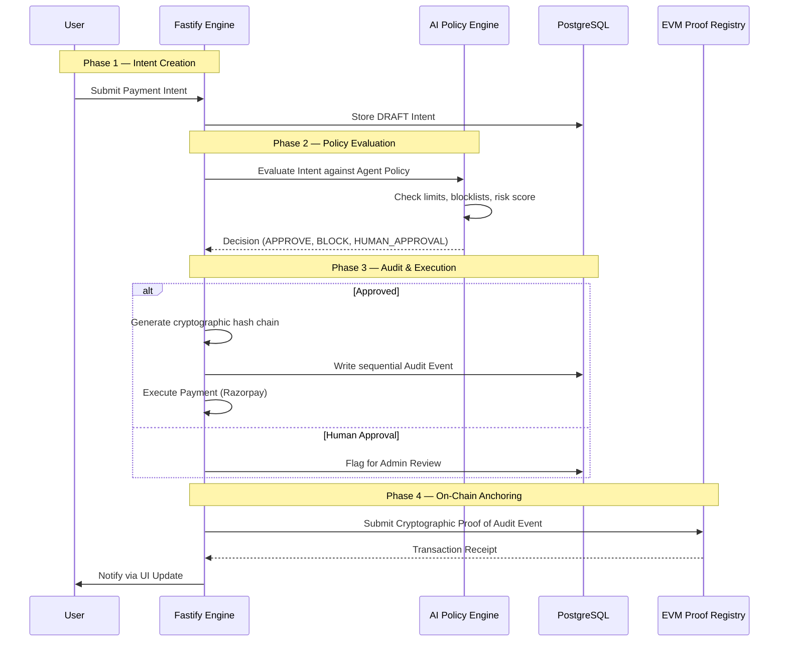
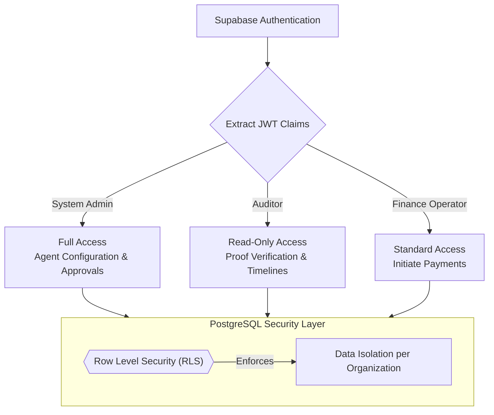
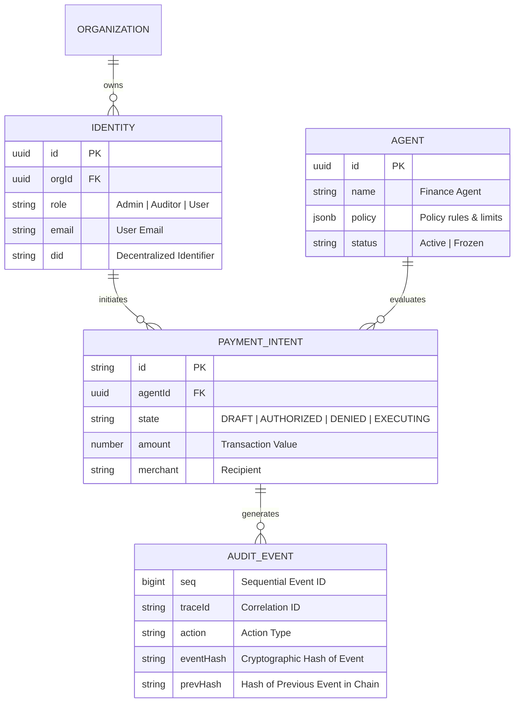
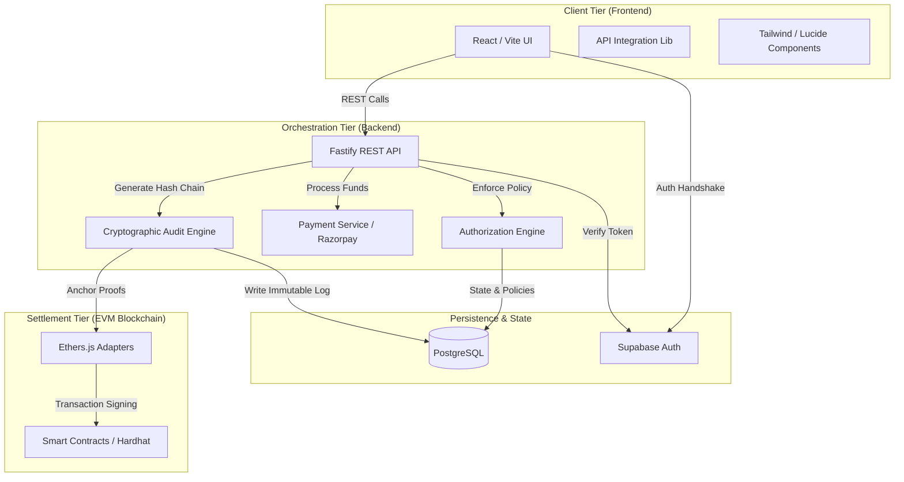

# TrustWeave: System Architecture

This document provides a detailed visual representation and technical breakdown of the TrustWeave architecture, logic flows, and security models, focusing on our immutable audit trails, AI-agent operations governance, and blockchain-anchored accountability.

---

## 1. High-Level System Architecture

This diagram shows the structural relationship between the protocol layers, including our AI Policy Engine and the Blockchain Proof Layer.

```mermaid
graph TD
    subgraph FE["Sovereign Interface — Frontend"]
        A[Dashboard & UI]
        B[Agent Configuration]
        C[Governance Hub]
        D[Payment Requests]
        E[Audit Timeline]
    end

    subgraph BE["Orchestration Engine — Backend"]
        F[Fastify API Server]
        G[Policy & Authorization Engine]
        H[Payment Service (Razorpay)]
        I[Audit & Hash Engine]
        J[(PostgreSQL / Supabase)]
    end

    subgraph CHAIN["Consensus Layer — EVM Blockchain"]
        K[Identity Registry Contract]
        L[Agent Registry Contract]
        M[Asset Registry Contract]
        N[Proof Registry Contract]
    end

    A -- "REST Calls" --> F
    D -- "Initiate Intent" --> G
    G -- "Evaluate Policy" --> J
    F -- "External Payment Exec" --> H
    G -- "Immutable Log" --> I
    I -- "Record State" --> J
    I -- "Anchor Cryptographic Proof" --> N
    F -- "Verify On-Chain" --> L
```

---

## 2. Agent Evaluation & Audit Flow

This sequence diagram illustrates the lifecycle of a payment intent operation — from rule triggering to blockchain-anchored finality.



---

## 3. Governance & RBAC Model

TrustWeave utilizes a rigorous Role-Based Access Control (RBAC) model managed directly at the database level via Supabase Row-Level Security (RLS) and JWT claims.



> [!NOTE]
> **Data Sovereignty**: The backend architecture prevents cross-tenant data leakage by enforcing tenant-id separation at the Postgres policy level, bypassing the application layer entirely for security.

---

## 4. Enhanced Database Schema

The PostgreSQL models are structured to ensure absolute accountability through cryptographic hashing on every state transition.



---

## 5. Component Dependency Map

This diagram visualizes the interconnected nature of the TrustWeave ecosystem, illustrating how data and logic flow between the client, orchestration, and blockchain settlement tiers.



---

## 6. Audit Chain Integrity Workflow

To maintain absolute transparency, the protocol records all state changes as an append-only linked list of cryptographic hashes in the database.

```mermaid
graph LR
    A[Action Triggered] --> B[Generate Payload Hash]
    B --> C[Fetch Previous Event Hash]
    C --> D[Compute sha256(Seq + Action + PrevHash + Payload)]
    D --> E[Write Audit Event to Postgres]
    E --> F[Periodically Submit to ProofRegistry On-Chain]
```

> [!TIP]
> Use the provided `npm run db:seed:history` script to generate a verifiable history chain of test data to observe this linked-list cryptography in action.

---

## 7. Aesthetic Dashboard Layer

The frontend utilizes a clean, enterprise-grade aesthetic focused on clarity and data density for governance operations.

- **Fast & Responsive**: Powered by Vite and React for instant hot-module reloading and optimized production builds.
- **Enterprise Design System**: Clean typography, subtle borders, and precise iconography using Lucide-React.
- **Visual Evidence**: Dynamic timelines and expandable policy evaluation breakdowns provide immediate, readable evidence of AI logic decisions.

---

### Technology Stack Summary

| Layer | Core Technologies |
| :--- | :--- |
| **Frontend** | React, Vite, TailwindCSS, Ethers.js |
| **Backend** | Node.js, Fastify, Supabase |
| **Database** | PostgreSQL (Relational Persistence & RLS) |
| **Smart Contracts** | Solidity, Hardhat, EVM Ecosystem |
| **Payments** | Razorpay Payment Gateway |
